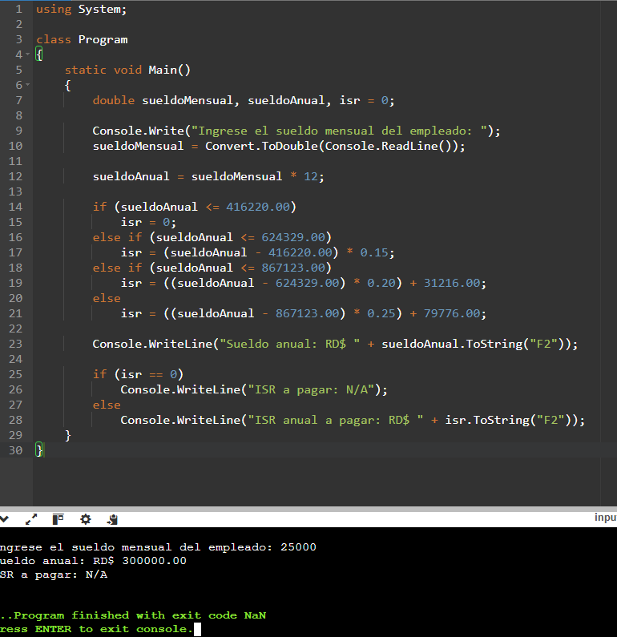
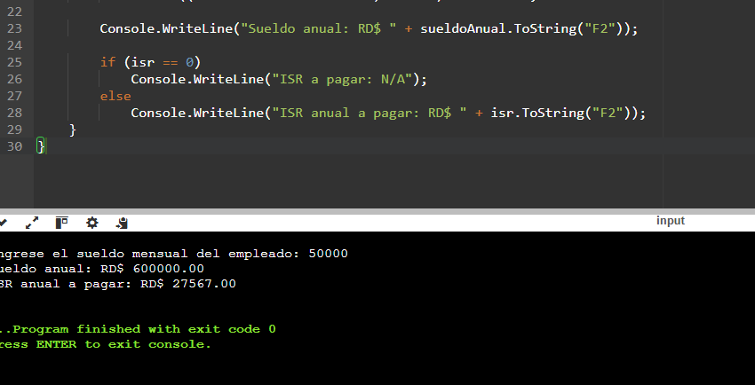
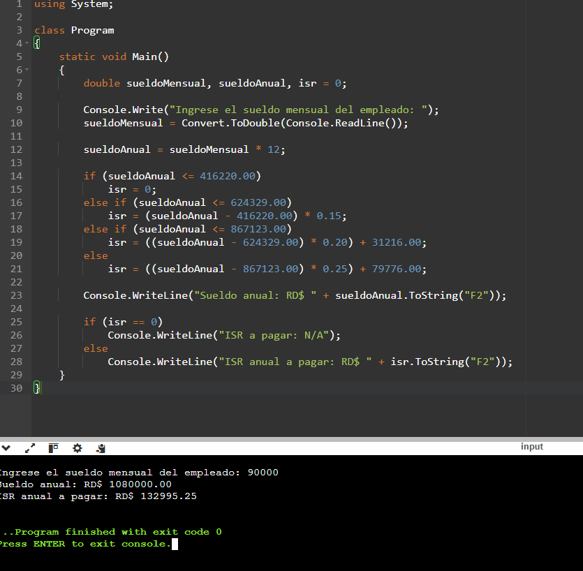

## Carrera: Ingeniería de Software
## Asignatura: Programación Básica
## Profesor: Gamalier Reyes del Carmen

# Cálculo de ISR en C#

Este proyecto consiste en un programa desarrollado en C# que calcula el Impuesto Sobre la Renta (ISR) en República Dominicana.

## Descripción
El sistema permite ingresar el salario de un empleado y calcula automáticamente el ISR correspondiente según las reglas establecidas.

## Funcionalidades
- Entrada de salario
- Cálculo automático de ISR
- Muestra el resultado en pantalla

## Tecnologías
- Lenguaje: C#
- Consola (Aplicación básica)

## Autor
Daikel Sabino - 2022-4384.

## Ejecución del programa

### Escenario 1

### Escenario 2

### Escenario 3

